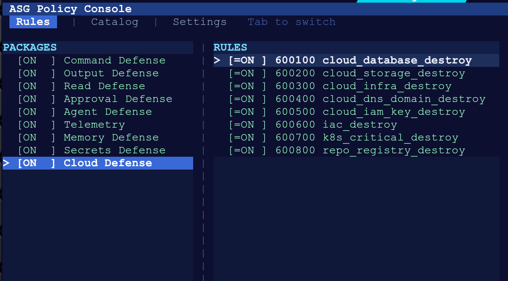
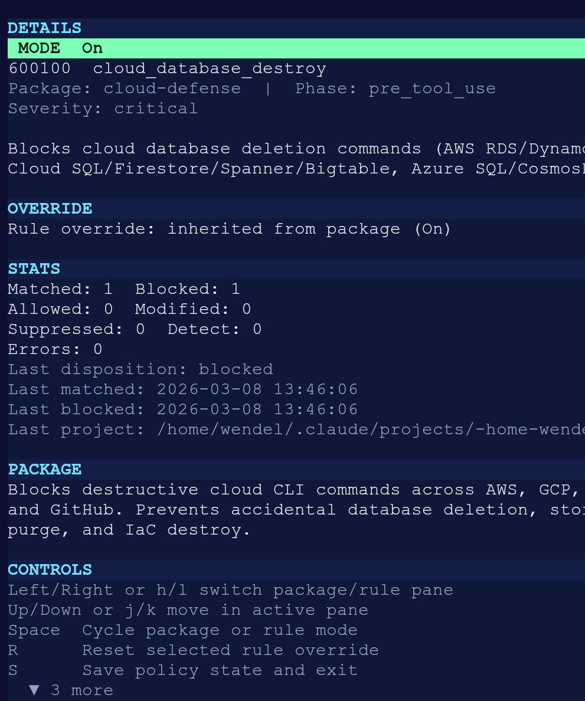
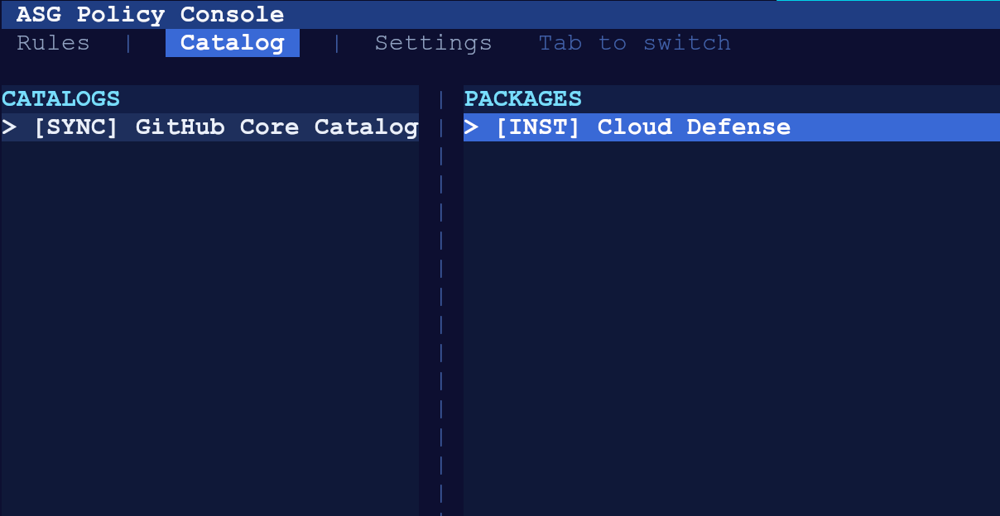
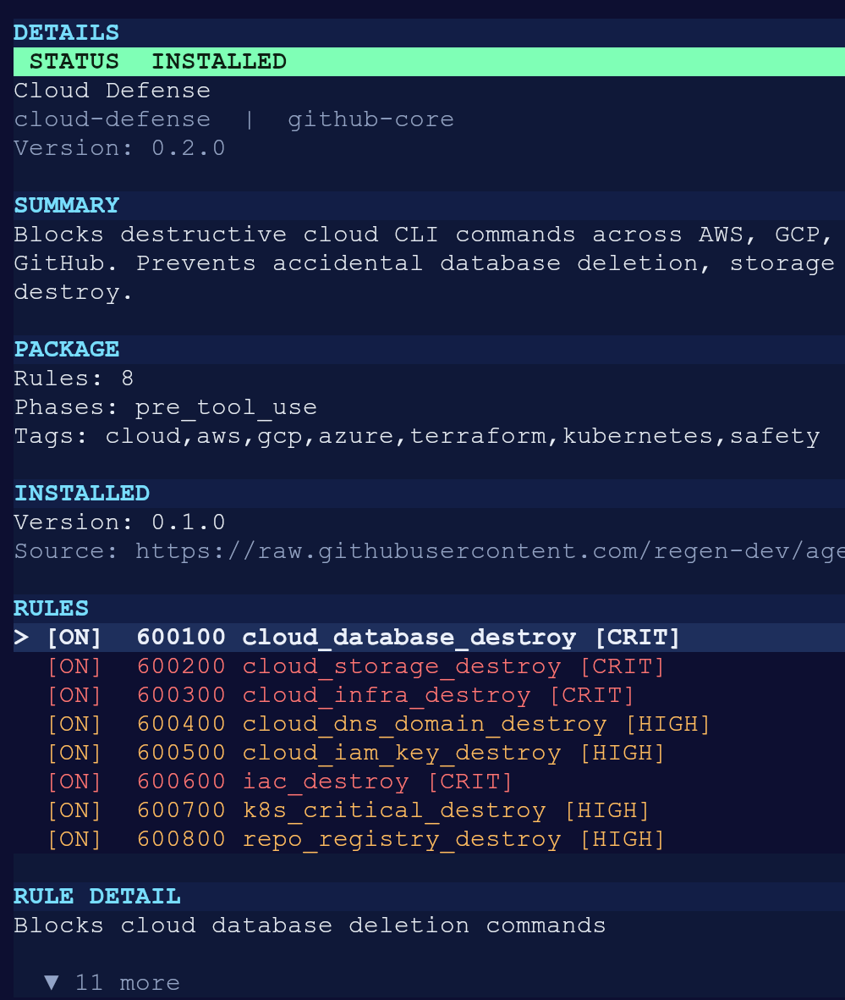
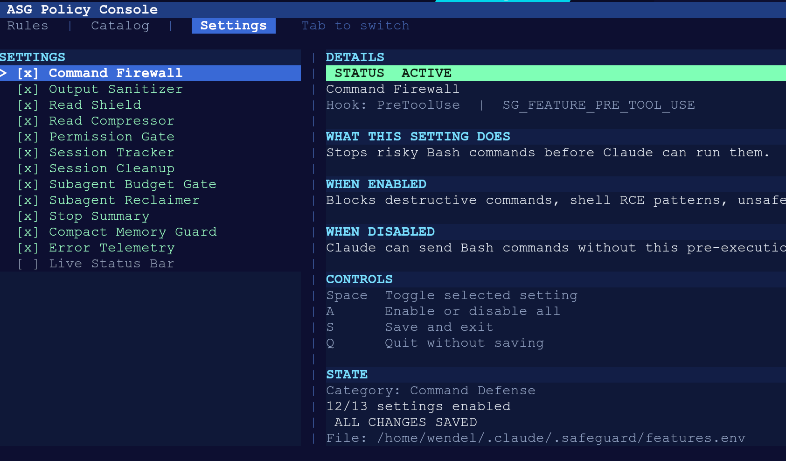

# agent-safe-guard

[](https://github.com/regen-dev/agent-safe-guard/actions/workflows/ci.yml)
[](LICENSE)

Native safety hooks for [Claude Code](https://docs.anthropic.com/en/docs/claude-code) on Linux.

`agent-safe-guard` sits between Claude Code and its tool calls. It blocks destructive commands, trims noisy output, guards large reads, enforces subagent budgets, records audit events, and exposes a native rule/package console.

## Why

AI coding agents execute shell commands, read files, and make permission decisions on your behalf. Without guardrails, a single hallucinated `rm -rf /` or a leaked `.env` read can cause real damage. `agent-safe-guard` adds a fail-closed enforcement layer that runs before every tool call reaches your system.

## Current Release

- Linux-first, native-only runtime (C++20 daemon + hook clients)
- Source install today
- `.deb` and AppImage planned
- Windows and macOS on the roadmap behind a transport abstraction

## What It Does

- Blocks destructive shell patterns (`rm -rf /`, fork bombs, `curl | bash`, force pushes to protected branches)
- Requires quiet flags for commands that would flood context
- Denies bundled, generated, binary, or oversized `Read` targets
- Compresses large `Read` outputs into structural summaries
- Auto-decides safe vs unsafe permission requests
- Masks secrets and credentials in file reads
- **Injects a ranked tree-sitter repo map at SessionStart so Claude stops re-reading files every session** (new — see [Repo Map](#repo-map-primer) below)
- Tracks session metrics, rule matches, tool latency, compaction, and subagent usage
- Supports extension packages from remote catalogs (marketplace)
- Lets you inspect and override policy at the package and rule level with `asg-cli`

## Screenshots

### Rules

Browse packages and their rules. Toggle individual rules on/off.



### Rule Detail

Inspect rule metadata, match stats, and override state.



### Catalog

Sync extension packages from remote catalogs and install them.



### Package Detail

View installed package info, version, tags, and contained rules.



### Settings

Toggle defense features and see what each one controls.



## Quick Start

Requirements:

- Linux (x86_64)
- `jq`
- `coreutils`
- `cmake` 3.20+
- A C++20 compiler (`g++` 10+ or `clang++` 13+)

Installation from source:

```bash
git clone https://github.com/regen-dev/agent-safe-guard.git
cd agent-safe-guard
git submodule update --init --recursive   # required — tree-sitter grammars + doctest + bats
cmake -S . -B build/native -DSG_BUILD_NATIVE=ON
cmake --build build/native -j$(nproc)
./build/native/native/asg-install
```

Notes:

- The installer creates native hook symlinks in `~/.claude/hooks/asg-*`.
- It installs `asg-cli`, `asg-statusline`, `asg-repomap`, `asg-install`, and `asg-uninstall` into `~/.local/bin`.
- It attempts to install and enable user `systemd` socket units for `sgd`.
- `~/.local/bin` should be on your `PATH`.
- Start a new Claude Code session after install.

If your environment does not have a working `systemd --user` session, use the manual daemon path:

```bash
./build/native/native/asg-install --no-enable-systemd-user
./build/native/native/sgd --socket /tmp/agent-safe-guard/sgd.sock
```

The native clients already probe `/tmp/agent-safe-guard/sgd.sock`, so this manual mode works without extra hook changes.

## Verify The Install

Check the installed entrypoints:

```bash
ls -l ~/.claude/hooks/asg-pre-tool-use
ls -l ~/.local/bin/asg-cli ~/.local/bin/asg-install ~/.local/bin/asg-uninstall
```

Check the public CLIs:

```bash
asg-install --help
asg-uninstall --help
asg-cli --print-rules
```

## Everyday Commands

Install or reinstall:

```bash
asg-install
```

Open the policy console:

```bash
asg-cli
```

Print package and rule state non-interactively:

```bash
asg-cli --print-rules
```

Uninstall hooks and launchers while preserving local config/state:

```bash
asg-uninstall
```

## How It Works

Hot-path enforcement is native:

1. Claude Code emits a hook event as JSON on stdin.
2. A native hook client (`sg-hook-*`) forwards the payload to `sgd` over a Unix socket.
3. The daemon evaluates built-in rules and compiled catalog patterns, then returns hook JSON.
4. Claude Code receives the decision (deny, allow, modify output, stop session).

All enforcement is fail-closed: if the daemon is unreachable, hook clients deny the tool call rather than letting it through.

Repository layout:

```text
config.env                  # Default thresholds and limits
native/                     # Native daemon, hook clients, CLI tools
  queries/                  # Tree-sitter tag queries (TS/JS) for the repo map
hooks/                      # Legacy/reference Bash implementation, not installed
systemd/                    # User systemd socket + service unit templates
third_party/                # Pinned submodules (tree-sitter + grammars, doctest)
docs/                       # Architecture, roadmap, and feature docs
tests/                      # bats-core integration tests (547 tests)
screenshots/                # README assets
```

## Configuration And State

Main config files and state directories:

- `~/.claude/.safeguard/config.env`
- `~/.claude/.safeguard/features.env`
- `~/.claude/.safeguard/policy/packages.json`
- `~/.claude/.safeguard/policy/installed.json`
- `~/.claude/.safeguard/policy/catalogs.json`
- `~/.claude/.safeguard/policy/stats/`
- `~/.claude/.statusline/events.jsonl`

Useful event inspection commands:

```bash
rg '"event_type":"rule_match"' ~/.claude/.statusline/events.jsonl
rg '"event_type":"blocked"' ~/.claude/.statusline/events.jsonl
rg '"event_type":"permission_decision"' ~/.claude/.statusline/events.jsonl
rg '"event_type":"read_guard"' ~/.claude/.statusline/events.jsonl
```

## Testing

Install does not require git submodules. Tests do.

```bash
git submodule update --init --recursive
make native-build
make test
```

Useful test targets:

- `make test` — all 547 tests, parallel
- `make test-unit` — unit tests only
- `make test-integration` — integration tests only
- `make coverage` — with line coverage report
- `make test-native-pre-smoke` — pre-tool-use smoke tests against native daemon
- `make test-native-rule-audit` — verify all rules compile and match expected inputs

The test suite runs in isolated temp homes. It does not touch your real `~/.claude` state.

## Repo Map Primer

A port of [aider](https://github.com/Aider-AI/aider)'s `RepoMap` to native C++20, integrated with the existing daemon.

At session start, the daemon walks your repo with tree-sitter, ranks files by cross-reference PageRank, and injects a compact `path:line kind name` map of the top files into Claude's `additionalContext`. Claude starts every session already knowing where the classes, interfaces, functions, and methods live — no warm-up Read/Grep volleys needed.

**Example.** After this lands, asking "does this repo have a `Promises` class?" on a fresh session gets answered instantly from the primer, no file I/O:

```
> o repo tem uma classe Promises? em qual arquivo e linha?

Sim, há duas cópias — ambas definem class Promises na linha 4:
  - app-gps-INOVA/src/Promises.js:4
  - app-gps-SAMU/src/Promises.js:4
```

### How it works

1. Tree-sitter parses each `.ts` / `.mts` / `.cts` / `.js` / `.mjs` / `.cjs` file (TSX + more languages planned for v0.3). Declaration files (`.d.ts`) are skipped.
2. A file graph is built from cross-file identifier references, weighted by name-shape heuristics.
3. Hand-rolled PageRank (50 iters, damping 0.85) ranks files.
4. The top-N tags are rendered as `rel_path:line kind subkind name` lines, sized under `SG_REPOMAP_MAX_TOKENS` (default 4096) via binary search on N. Per-file tag cap (default 40) keeps barrel re-exports from starving the budget.
5. Results are cached at `<repo>/.asg-repomap/tags.v1.bin`. On git repos, first build appends `.asg-repomap/` to `.git/info/exclude`. Subsequent session-starts mtime-check each file and only reparse what changed — typical warm update is under 100 ms even on 3k-file repos.

### Measurements

On Ryzen 9 9950X3D, single-threaded, against real TS/JS working repos:

| Repo size          | Cold build | Warm update | Cache  | Render (budget 4096) |
|---                 |---         |---          |---     |---                   |
|   370 source files | 3.3 s      | 10 ms       | 1.0 MB | 4 files / 160 tags   |
| 1 227 source files | 10.0 s     | 40 ms       | 3.1 MB | 3 files / 120 tags   |
| 3 235 source files | 21.6 s     | 100 ms      | 6.8 MB | 3 files / 120 tags   |

Render itself is sub-200 ms once the cache exists.

### Configure

All knobs are optional. Defaults ship enabled.

```bash
# ~/.claude/.safeguard/features.env
SG_FEATURE_REPOMAP=1                   # toggle the SessionStart injection

# ~/.claude/.safeguard/config.env (or env vars)
SG_REPOMAP_MAX_TOKENS=4096             # chars/4 budget for the injected map
SG_REPOMAP_MAX_FILE_BYTES=524288       # skip source files > 512 KB
SG_REPOMAP_MAX_TAGS_PER_FILE=40        # per-file tag cap (0 = unlimited)
```

Toggle interactively via `asg-cli` → Settings tab → "Repo Map Primer".

### Use the CLI directly

The `asg-repomap` binary is useful on its own for debugging, scripting, or pre-warming caches:

```bash
asg-repomap build  --root ~/src/my-repo            # full cache build
asg-repomap update --root ~/src/my-repo            # incremental (mtime-skip)
asg-repomap render --root ~/src/my-repo            # print the map
asg-repomap render --root ~/src/my-repo --budget 8192
asg-repomap stats  --root ~/src/my-repo            # files, tags, cache size
asg-repomap clean  --root ~/src/my-repo            # rm -rf .asg-repomap/
asg-repomap build  --file some.ts --tags           # single-file inspection
```

Full details in [docs/repomap.md](docs/repomap.md).

## Extension Packages (Catalog)

`agent-safe-guard` supports installing additional rule packages from remote catalogs. The default catalog is hosted at [regen-dev/agent-safe-guard-rules](https://github.com/regen-dev/agent-safe-guard-rules).

Sync and install via the `asg-cli` Catalog tab, or non-interactively:

```bash
asg-cli --catalog-sync
asg-cli --catalog-install cloud-defense
```

Catalog packages use SHA256 integrity checks. The daemon compiles catalog rule patterns into regex matchers at startup.

## Roadmap

Distribution and platform planning lives in [docs/distribution-roadmap.md](docs/distribution-roadmap.md).

Current direction:

- Ship a clean source release first
- Add `.deb` packaging for Debian/Ubuntu users
- Add AppImage for portable Linux installs
- Keep Windows and macOS on the roadmap as exploratory work behind a transport/service abstraction checkpoint

## Documentation

- [native/README.md](native/README.md) — native runtime, protocol, event logging
- [docs/repomap.md](docs/repomap.md) — repo map algorithm, CLI, configuration, measurements
- [docs/rule-engine-architecture.md](docs/rule-engine-architecture.md) — phase model, ModSecurity-style engine
- [docs/policy-catalog-console-plan.md](docs/policy-catalog-console-plan.md) — catalog and console UX design
- [docs/distribution-roadmap.md](docs/distribution-roadmap.md) — packaging and platform plan

## Contributing

See [CONTRIBUTING.md](CONTRIBUTING.md).

## Security

For vulnerability reports, see [SECURITY.md](SECURITY.md).

## License

MIT. See [LICENSE](LICENSE).
